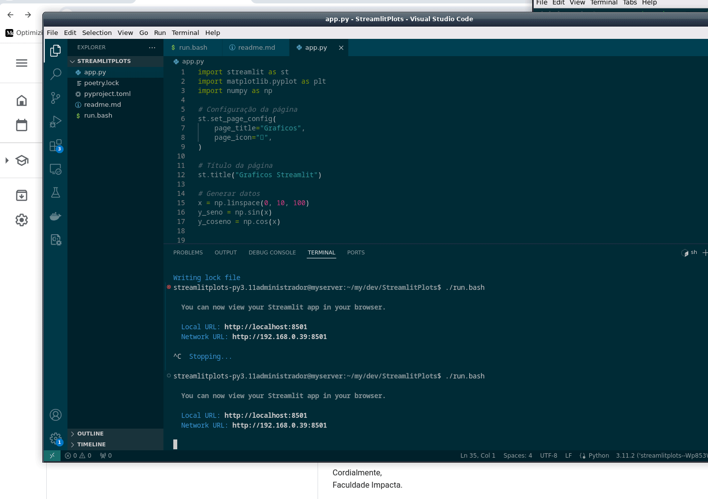

# Graficos/Plot no Streamlit
    
    

    Exemplo de uso de graficos em streamlit

# Compilação e execução( Build )

```
poetry install
 ./run.sh
```
## Bibliotecas

* [streamlit](https://streamlit.io/) - Plataforma para desenvolvimento web em python
* [poetry](https://python-poetry.org/) - Gerenciador de Dependencia

 